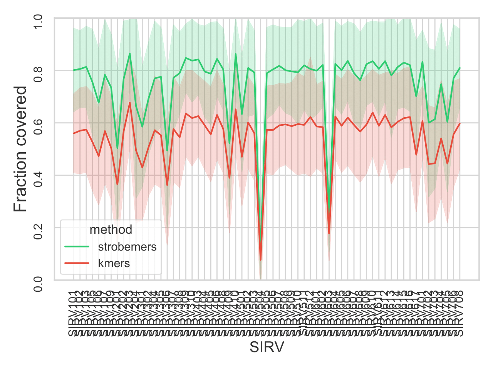
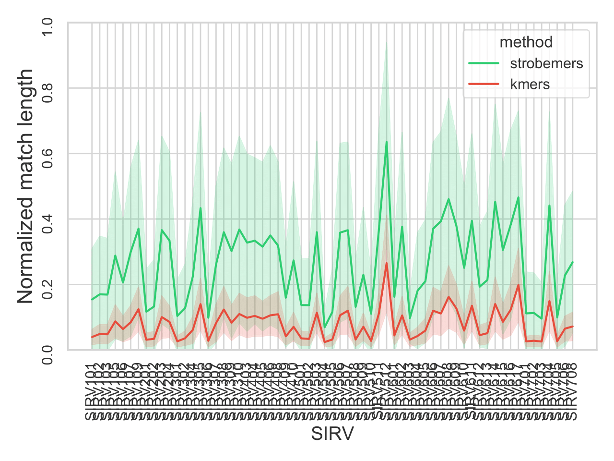
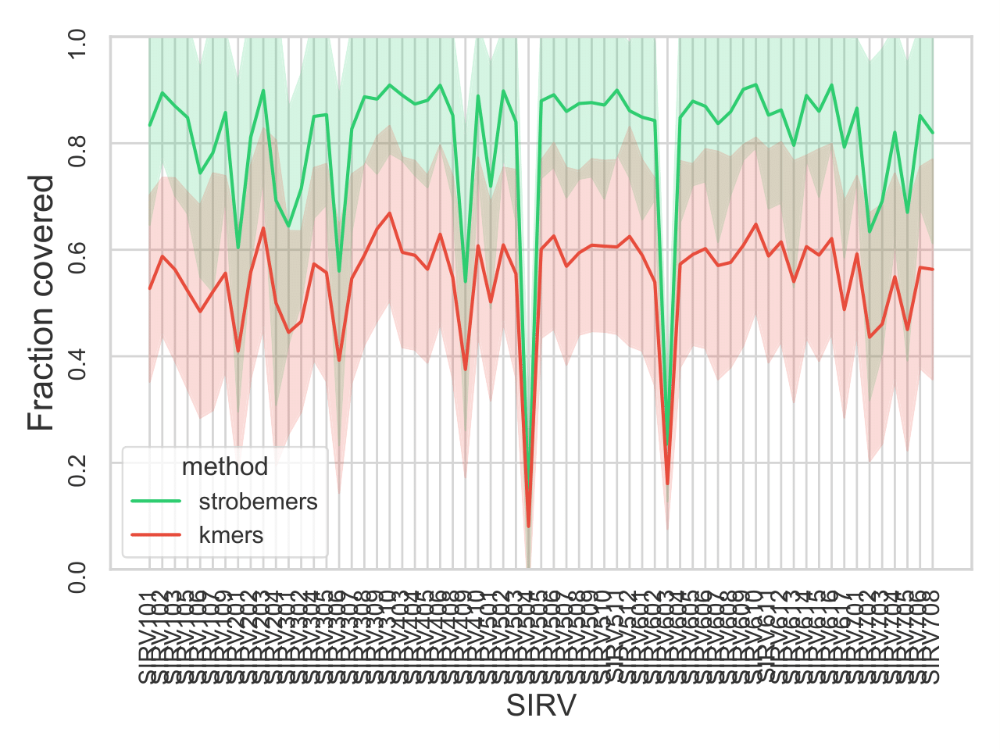
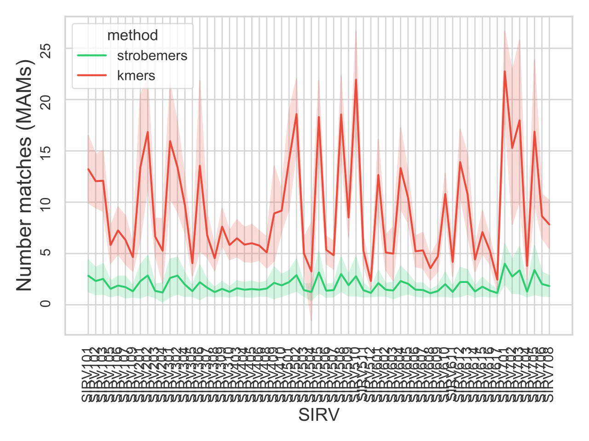

Strobemers
===========

A repository for generating strobemers and evaluation.  

# This repository

The repository consists of a python library, a C++ library (work in progress) and a tool `StrobeMap` implemented in Python. 

The C++ library `strobemers_cpp/index.[cpp/hpp]` contains functions for creating the randstobes (order 2 and 3), hybridstrobes (order 2 and 3) and minstrobes (order 2).

The python library `indexing.py` contains functions and generators for creating the datastructures used in the evaluation of the [preprint](https://doi.org/10.1101/2021.01.28.428549). 

The tool `StrobeMap` is a program which roughly has the same interface as `MUMmer`. `StrobeMap` takes a reference and queries file in fasta or fastq format. It produces NAMs (Non-overlapping Approximate Matches) between the queries and references and outputs them in a format simular to nucmer/MUMmer. See [preprint](https://doi.org/10.1101/2021.01.28.428549) for definition of NAMs.


<!-- First off, this is a prototype implementation created for the analysis in the [preprint](https://doi.org/10.1101/2021.01.28.428549) describing strobemers. As Python is inefficient with string manipulation, any real implementation and usage of strobemers should probably happen in a low level language. However, the Python code is sufficient as proof of concept.  -->

### Other implementations of strobemers 

Strobemers are implemented in
- [C++](https://github.com/BGI-Qingdao/strobemer_cpptest)
- [Go](https://github.com/shenwei356/strobemers)

# C++ implementation in this repository

I have also implemented randstrobes (order 2 and 3), hybridstrobes (order 2), and minstrobes (order 2). They can be used by copying `index.cpp` and `index.hpp` in the `strobemers_cpp` folder in this repository. The implementation of these functions uses bitpacking and some other clever tricks (inspired by [this repo](https://github.com/lh3/kmer-cnt)) to be fast. The functions be used as follows:

```
typedef std::vector< std::tuple<uint64_t, unsigned int, unsigned int, unsigned int, unsigned int>> strobes_vector;
strobes_vector randstrobes3; // (kmer hash value, seq_id, strobe1_pos, strobe2_pos, strobe3_pos)
seq = "ACGCGTACGAATCACGCCGGGTGTGTGTGATCGGGGCTATCAGCTACGTACTATGCTAGCTACGGACGGCGATTTTTTTTCATATCGTACGCTAGCTAGCTAGCTGCGATCGATTCG";
n=3;
k=15;
w_min=16;
w_max=30;
seq_id = 0; // using integers for compactness, you can store a vector with accessions v = [acc_chr1, acc_chr2,...] then seq_id = 0 means v[0].

randstrobes3 = seq_to_randstrobes3(n, k, w_min, w_max, seq, seq_id);
for (auto &t : randstrobes3) // iterate over the strobemer tuples
{
strobemer_hash = std::get<0>(t);
strobe1_pos = std::get<2>(t);
strobe2_pos = std::get<3>(t);
strobe3_pos = std::get<4>(t);
// if you want the actual strobemer sequences:
randstrobe = seq.substr(strobe1_pos, k) + seq.substr(strobe2_pos, k)+ seq.substr(strobe3_pos, k);
}
```

If you are using some of `seq_to_randstrobes2`, `seq_to_hybridstrobes2`, or `seq_to_minstrobes3` they return the same vector tuples but position of strobe 2 copied twice, i.e., `(kmer hash value, seq_id, strobe1_pos, strobe2_pos, strobe2_pos)`. 

My benchmarking is saying that randstrobes is roughly as fast as hybridstrobes and minstrobes, and that randstrobes is unexpectedly fast in this implementation in general, about 2-3 times slower than generating k-mers for randstrobes of (n=2, s=15, w_min=16,w_max=70). What takes time is pushing the tuples to vector and not computing the strobemers. But more detailed investigation will follow.

#### Notes, limitations and constraints

Because of bitpacking, the limitation is that any single strobe cannot be lager than 32, which means that the maximum strobemer length for randstrobes of order 3 is `3*32 = 96`, and `2*32 = 64` for order 2. This should be large enough for most applications. 

Another constraint is that `w_min > k`.s I don't see the immediate use case of setting `w_min<=k` (which would not yield disjoint strobes and therefore could give shorter strobemers than `n*k`).  

At ends of sequences (e.g., reads), there is no need to shrink windows to assure that the number of strobemers generated is the same as the number of k-mers. This is because if we modify windows at the ends, they are not guaranteed to match the reference, as first described in [this issue](https://github.com/ksahlin/strobemers/issues/2). Therefore, in my implementation, there will be `n - (k + w_min) +1` strobemers of order 2 generated form a sequence of length `n`, and `n - (k + w_max + w_min) +1` strobemers of order 3. In other words, we will only slide last strobe's window outside the sequence. Once it is fully outside the sequence we stop (illistrated in approach B for order 2 in [here](https://github.com/ksahlin/strobemers/issues/2).


# Python implementation in this repository

The `indexing.py` module located in the `modules` folder contains functions for generating k-mers, spaced k-mers, minimizers, and strobemers (minstrobes, hybridstrobes, and randstrobes) of order 2 and 3. For randstrobes, there are two ways to create them. The first way is with the function `randstrobes`, which takes a string, k-mer size, and upper and lower window limits and returns a dictionary with positions of the strobes as keys and the hash value of the randstrobe sequence (strings) as values. For example

```
from modules import indexing
all_mers = defaultdict(list)
for (p1,p2,p3), h in indexing.randstrobes(seq, k_size, w_min, w_max, order = 3).items():
    # all_mers is a dictionary with hash values as keys and 
    # a list with position-tuples of where the strobemer is sampled from
    all_mers[h].append( (p1,p2,p3) )  
```
Functions `minstrobes` and `hybridstrobes` have the same interface.

The second way is to call `randstrobes_iter` which is a generator. Similarly to `randstrobes`, `randstrobes_iter` takes a string, k-mer size, and upper and lower window size, but instead yields randstrobes from the sequence and is not as memmory requiring as the `randstrobes` function which store and returns all the strobes in a dictionary. `randstrobes_iter` generating randpers of order 2 can be used as follows

```
from modules import indexing
all_mers = defaultdict(list)
for (p1,p2), s in indexing.randstrobes_iter(seq, k_size, w_min, w_max, order = 2, buffer_size = 1000000):
    all_mers[s].append( (p1,p2) )  
```
Functions `minstrobes_iter` and `hybridstrobes_iter` have the same interface.


# Using StrobeMap

`StrobeMap` implements order 2 and 3 hybridstrobes (default), randstrobes, minstrobes, as well as kmers. The tool produces NAMs (Non-overlapping Approximate Matches; see explanation in preprint) for both strobemers and kmers. Test data is found in the folder `data` in this repository.
Here are some example uses:

```
# Generate hybridstrobe matches (hybridstrobe parametrization (2,15,20,70)) 
# between ONT SIRV reads and the true reference sequences

./StrobeMap --queries data/sirv_transcripts.fasta \
           --references data/ONT_sirv_cDNA_seqs.fasta \
           --outfolder strobemer_output/  --k 15 
           --strobe_w_min_offset 20 --strobe_w_max_offset 70


# Generate kmer matches (k=30) 
# between ONT SIRV reads and the true reference sequences

./StrobeMap --queries data/sirv_transcripts.fasta \
           --references data/ONT_sirv_cDNA_seqs.fasta \
           --outfolder kmer_output/  --k 30 --kmer_index

# Reads vs reads matching using randstrobes

./StrobeMap --queries data/ONT_sirv_cDNA_seqs.fasta \
           --references data/ONT_sirv_cDNA_seqs.fasta \
           --outfolder strobemer_output/ --k 15 \
           --strobe_w_min_offset 20 --strobe_w_max_offset 70 \
           --randstrobe_index
```

Minstrobes has the same parameters as hybridstrobes and randstrobes but are invoked with parameter `--minstrobe_index`


## Output

The output is a file `matches.tsv` in the output folder. You can se a custom outfile name with the parameter `--prefix`.
Output format is a tab separated file on the same format as MUMmer, with identical fields except the last one which is approximate reference sequence match length instead of what MUMmer produce:

```
>query_accession
ref_id  ref_pos query_pos   match_length_on_reference
```

Small example output from aligning sirv reads to transcripts (from the commands above) which also highlights the stobemers strength compared to kmers. While kmers can give a more nuanced differentiation (compare read hits to `SIRV606` and `SIRV616`) both the sequences are good candidates for downstream processing. In this small example, the strobemers produce fewer hits/less output needed for post clustering of matches, e.g., for downstream clustering/alignment/mapping. Notice that randstobe hit positions are currently not deterministic due to hash seed is set at each new pyhon instantiation. I will fix the hash seed in future implementations.


**Randstrobes (2,15,20,70)**
```
>41:650|d00e6247-9de6-485c-9b44-806023c51f13
SIRV606 35      92      487
SIRV616 35      92      473
>56:954|a23755a1-d138-489e-8efb-f119e679daf4
SIRV509 3       3       515
SIRV509 520     529     214
SIRV509 762     767     121
>106:777|0f79c12f-efed-4548-8fcc-49657f97a126
SIRV404 53      131     535
```

**kmers (k=30)**
```
>41:650|d00e6247-9de6-485c-9b44-806023c51f13
SIRV606 33      90      46
SIRV606 92      150     125
SIRV606 219     275     81
SIRV606 349     408     70
SIRV606 420     479     47
SIRV606 481     540     42
SIRV616 33      90      46
SIRV616 92      150     125
SIRV616 219     275     81
SIRV616 349     408     60
SIRV616 409     482     44
SIRV616 467     540     42
>56:954|a23755a1-d138-489e-8efb-f119e679daf4
SIRV509 68      72      141
SIRV509 230     233     100
SIRV509 331     335     105
SIRV509 435     442     40
SIRV509 475     483     36
SIRV509 579     585     41
SIRV509 621     627     46
SIRV509 695     701     44
SIRV509 812     815     53
>106:777|0f79c12f-efed-4548-8fcc-49657f97a126
SIRV404 53      131     58
SIRV404 128     208     127
SIRV404 283     364     30
SIRV404 422     494     142
```

<!-- ## What is a NAM?

The aim is to output regions that _approximately match eachother_ on the reference and query (just like MEMs are exact matches between query and reference). The NAM regions can then be used to detect as candidate regions for alignment, clustering, or any other downstream analysis. 

The 'approximate' part is that there is a strobemer match, and the maximal is that we will merge matches that overlap on both query and reference sequence (if the order of the matches is the same on both the query and reference sequence). The 'maximal' _seems_ to be well defined if there are no repetitive matches in either the query or the reference. However, is is not trivial to compute if there are nested repeats in _both_ the query and reference. Currently, this is what is implemented:

For kmers, any two k-mer matches spanning positions `(q_1, q_1+k)` and `(q_2, q_2+k`) on the query and positions `(r_1, r_1+k)` and `(r_2, r_2+k)` on the reference where `q_1 <= q_2 <= q_1+k <= q_2+k` and `r_1 <= r_2 <= r_1+k <= r_2+k` are merged into one match of length `r_2+k - r_1`. Any chain of such overlapping matches are merged into one match. 


For strobemers, `StrobeMap` saves the positions for both the first and second strobe. Two strobemers with start positions `(q_1, q'_1)` and `(q_2, q'_2)` on the query and `(r_1, r'_1)` and `(r_2, r'_2)` on the reference with length `k` strobes _overlap_ if `q_1 <= q_2 <= q'_1 +k` and `r_1 <= r_2 <= r'_2+k`. If there is an overlap the two strobes are merged into one match of length `max(q'_1+k, q'_2 + k) - q_1`. Notice that because of the random length between the strobes, we can either have `q_1 <= q_2 <= q'_1 <= q'_2` or `q_1 <= q_2 <= q'_2 <= q'_1`, hence we need the `max` function. Any chain of such overlapping matches are merged into one match. 


The tool currently have a known bug of not being able to merge matches when there exist a repeat occuring at least twice within _both_ the query and reference sequence. In this case the matches may become fragmented, i.e., not merged into MAMs. -->
<!-- 
## Proof of concept

I aligned ONT cDNA reads (meadian error rate 7.0%) from [this synthetic RNA dataset](https://www.ebi.ac.uk/ena/browser/view/PRJEB34849) to SIRV transcripts [available here](https://github.com/ksahlin/strobemers/blob/main/data/sirv_transcripts.fasta) using minimap2 with parameters `-k 10 -w 1` providing very sensitive/accurate alignment. The ONT reads have been processed into full length reads using pychopper. Thus, ideally all reads should span and align to the full transcript. I selected 100 reads aligning to each SIRV transcript (primary alignment), and compared match coverage and number of hits between the 100 reads and their reference transcript using kmers **(k=30)** and strobemers **(n=2,k=15,w50)** giving the same subsequence length of 30nt each.

The aim is that the matching should provide candidate regions/sequences to perform exact alignment against. Match coverage and number of hits are two important features for sequence matching. Match coverage in this experiment is the fraction of reference sequence covered. Number of hits is the number of MAMs per read. We want the match coverage to be high in this experiment since we know that the reads align well to the their respective SIRV reference. However, together with a high coverage, we want the number of matches to be as low as possible (where 1 is best) in order for fast post prosessing/clustering of matches (a.k.a. seeds) and low disk space. 

Below I show the match coverage and number of hits for strobemers and kmers in this experiment separated for each of the 63 SIRVs with more than 100 primary alignment. The line shows the mean and the shaded area around the line is the standard deviation of the data (i.e., coverage/nr matches) for each SIRV.





The two above metrics could be studied from another angle, which is the match length normalized with the SIRV transcript length. The plot below shows the mean normalized match length for kmers and strobemers.



### Window placement matters

Above plots were produced with a second strobe produced from a window adjacent to the first kmer `k_1`, i.e., at offset positions `[0,50]` of the end of `k_1`. If we place the window in which we sample the second strobe a bit further donwstream (here I choose `[20,70]`), we get the following improved results where many of the strobemer MAMs cover the complete reference.



 -->


CREDITS
----------------

Kristoffer Sahlin, Strobemers: an alternative to k-mers for sequence comparison, bioRxiv 2021.01.28.428549; doi: https://doi.org/10.1101/2021.01.28.428549

Preprint found [here](https://doi.org/10.1101/2021.01.28.428549)